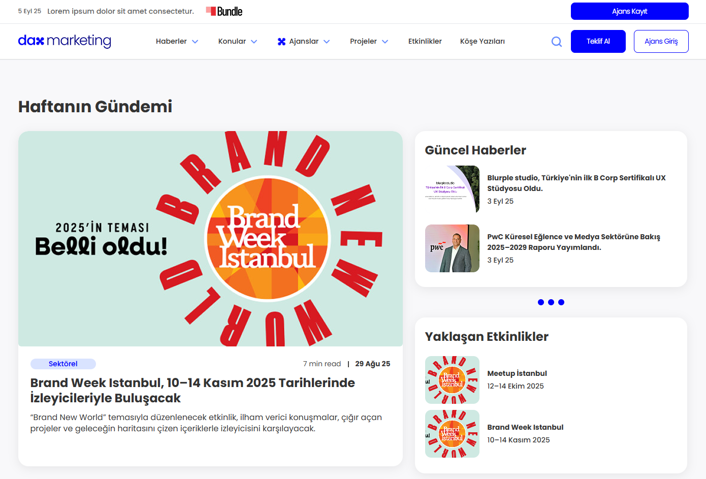

# Marketing Website

##### `Made this website for a client from Fiverr.`

## Description
A responsive static website built with Vue.js and Tailwind. 
The project focuses on modern UI design and responsive layouts for different screen sizes.

## Technologies Used
- Vue.js
- Tailwind CSS
- JavaScript

## Features
- Fully responsive design
- Clean and modern UI
- Mobile-friendly layout

## Live Demo
https://dax-marketing.vercel.app/

## Screenshots

## Author
Umair
